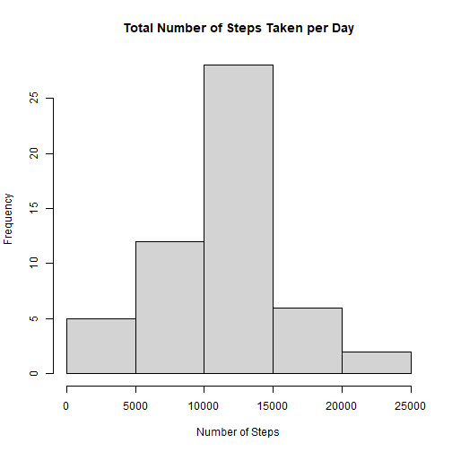
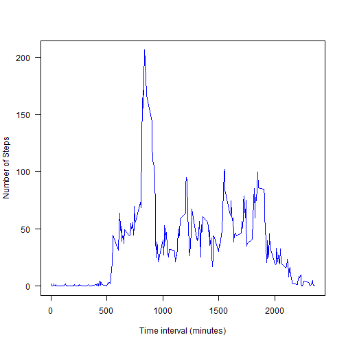
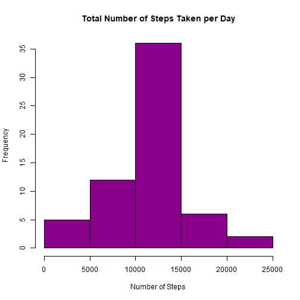
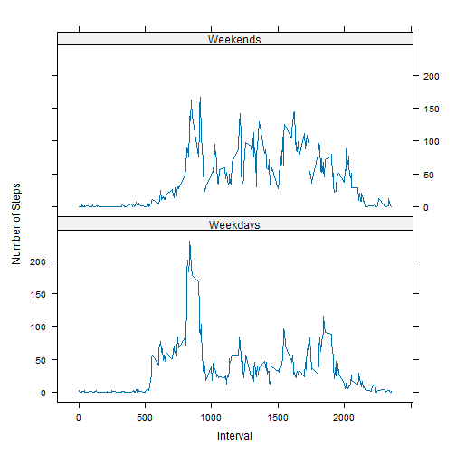

## Loading and preprocessing the data  

The zipped file proved was unzipped using the *untar* function and the csv file was then read using the *read.csv* function. The dataset was assigned to the name "activity".  


```r
untar("activity.zip")

activity <- read.csv("activity.csv")

# convert the date variable from character to date
activity$date <- as.Date(activity$date, format = "%Y-%m-%d")
```


## What is mean total number of steps taken per day?

The mean total number of steps taken per day are shown on the histogram below. The *aggregate* function is used to compute the total number of steps taken per day. The frequency distribution of the number of steps taken per day is then plotted as a histogram. 


```r
# total number of steps taken per day 
daily_steps <- aggregate(activity$steps, by = list(activity$date), sum)

# plot histogram of daily steps
hist(daily_steps$x, freq = TRUE, main = "Total Number of Steps Taken per Day", 
     xlab = "Number of Steps")
```



The mean and median number of steps taken per day can be calculated from the "daily_steps" dataframe. The following code computes the mean and the median number of steps taken per day, while ignoring missing values. 


```r
# mean number of steps
average <- mean(daily_steps$x, na.rm = TRUE)

# median number of steps
median_steps <- median(daily_steps$x, na.rm = TRUE)
```

The mean number of steps per day is 1.0766189 &times; 10<sup>4</sup>. 
The median number of steps per day is 10765

## What is the average daily activity pattern?

The average daily activity pattern is shown using a time series plot that shows the mean number of steps for each five-second interval across days.


```r
# mean number of steps per interval across days 
interval_steps <- aggregate(activity$steps, by = list(activity$interval), mean,
                            na.rm = TRUE)

# plot the average number of steps against the time interval 
plot(interval_steps$Group.1, interval_steps$x, xlab = "Time interval (minutes)", 
     ylab = "Number of Steps", type = "l", col = "blue", las = 1)
```



```r
# interval with the highest average number of steps across all days
maximum <- interval_steps$Group.1[which.max(interval_steps$x)]
```

The interval with highest mean number of steps starts at 835

## Imputing missing values

The number of rows with missing values was computed using the is.na and sum functions. 


```r
# number of rows with missing values 
total_NA <- sum(is.na(activity$steps))
```

The total number of missing values in the dataset is 2304.  

The missing values (NAs) in the steps variable were replaced by the mean values for the respective  5-minute interval calculated across days.


```r
# load dplyr package
library(dplyr)
```

```
## 
## Attaching package: 'dplyr'
```

```
## The following objects are masked from 'package:stats':
## 
##     filter, lag
```

```
## The following objects are masked from 'package:base':
## 
##     intersect, setdiff, setequal, union
```

```r
# replace NAs with the average value at the same time on different days
activity_filled <- activity %>%
    group_by(interval) %>%
    mutate(steps = ifelse(is.na(steps), mean(steps, na.rm = TRUE), steps)) %>%
    ungroup()
```

The mean total number of steps taken per day are shown on the histogram below. The *aggregate* function is used to compute the total number of steps taken per day. The frequency distribution of the number of steps taken per day is then plotted as a histogram. 


```r
# total number of steps taken per day 
daily_steps_filled <- aggregate(activity_filled$steps, 
                         by = list(activity_filled$date), sum)

# plot histogram of daily steps
hist(daily_steps_filled$x, freq = TRUE, main = "Total Number of Steps Taken per Day", 
     xlab = "Number of Steps", col = "magenta4")
```



The mean and median number of steps taken per day can be calculated from the "daily_steps_filled" dataframe. The following code computes the mean and the median number of steps taken per day. 


```r
# mean number of steps
average_filled <- mean(daily_steps_filled$x)

# median number of steps
median_filled <- median(daily_steps_filled$x)
```

The mean number of steps was 1.0766189 &times; 10<sup>4</sup>, while the median number of steps was 1.0766189 &times; 10<sup>4</sup>.  
Replacing NAs with mean values of the corresponding 5-minute interval has no effect on the computed average value. However, it lead to an increase in the median by about 1.19 steps.   


## Are there differences in activity patterns between weekdays and weekends?

A factor variable, "day_factor" was added to the dataset with filled-in missing values. The factor classifies the dates as either falling on a weekend or a weekday. The *ifelse* function was used to classify rows as either belonging to the weekend or weekdays.  


```r
# add a factor column to the activity_filled dataset 
activity_filled$day_factor <-  as.factor(ifelse((weekdays(activity_filled$date) == "Saturday" | weekdays(activity_filled$date) == "Sunday"), "Weekends", "Weekdays"))
```

The differences in activity patterns between weekdays and weekends are shown on the panel plot below. The plot was constructed using the *lattice* package. Data was initially grouped by 5-minute time interval and the type of day. The mean number of steps was then calculated for each 5-minute interval across either weekdays or weekends. 


```r
# load the lattice package 
library(lattice)

# calculate mean steps per 5-minute interval across days
# days are grouped according to whether they are weekdays or weekends 
activity_filled2 <- activity_filled %>%
  group_by(interval, day_factor) %>%
  summarise(steps = mean(steps))
```

```
## `summarise()` has grouped output by 'interval'. You can override using the `.groups`
## argument.
```

```r
# plot a time series plot 
xyplot(steps ~ interval | day_factor, data = activity_filled2, type = "l", 
      xlab = "Interval", ylab = "Number of Steps", layout = c(1, 2))
```



The mean activity on weekdays peaks the 1000th minute after which it drops. However, on weekends activity remains fairly high after the 1000th minute. 

